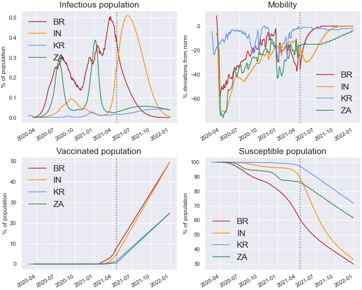

# covid19macro

A flexible quantitative framework for joint epidemiological-economic projections of the Covid-19 pandemic. 

The repository produces forecasts of key epidemiological states, such as cases, deaths, new infections etc., as well as mobility which is used here as a proxy for economic activity (convertible to GDP). Virtually all the data used are publicly available and automatically downloaded within the code. The model is flexible and can accommodate various scenarios as well as any other countries with mobility and health data (cases, deaths and vaccinations).  

#### For latest update, [see below](#latest-update)

### Background 
The repository accompanies the paper "Macroeconomic consequences of pandexit". The following is the abstract (as of 12 Mar 2021):

*This paper proposes a quantitative framework to analyse the interactions between epidemiological and economic developments, and assesses the macroeconomic impact of managing the late stage of the Covid-19 pandemic. The framework features a susceptible-exposed-infectious-recovered (SEIR)-type model that describes the pandemic evolution conditional on society's mobility choice, and a policy unit that chooses mobility optimally to balance lives and livelihood objectives. The model can be matched to daily data via a fast and robust empirical procedure, allowing a timely policy analysis as situations evolve. As of 10 March 2021, the projected median output loss across 27 advanced and emerging market economies in 2021 is about 2.25% of pre-pandemic trends. This projected outcome hinges on a sustained progress in vaccination and no major epidemiological setbacks. Vaccination impediments or a third-wave surge in infection rate could raise median output loss to 3-3.75%. In the most severe scenario, virus mutations that compromise existing immunity could require more protracted lockdowns. In this case, median output loss may reach 5% in 2021 alone, with further repercussions in subsequent years.*

Please consult the manuscript in the root folder for details.

### How to run the code:
All the codes are in the folder "codes". To run everything from scratch, run the calling file `main_paper.py`. This will download all data, implement all the empirical procedure and return all figures used in the paper. These pictures are saved in the folder 'pics', and estimated parameters in folder 'params'.

For more advanced usage, please consult the paper and note the following:
1. Projections require assumptions about future vaccination pace. Current formulation uses total contracted dosages as an input, which are manually taken from Bloomberg (file 'vaccine_contracts.xlsx') and loaded into the model via file `data_vaccines`. 
2. The key model file `seir_simple` contains the solveCovid class that implements all the steps for a given country. The \__init\__ function specifies all common assumptions, includling policy function (fit to data or exogenous), infection shock process, vaccination assumptions and all other scenario assumptions.  

### Latest update 

#### 2 May 2021

#### Forecasts for selected advanced economies

#### Forecasts for selected emerging market economies

#### Summary table for selected countries (baseline)
|    |   Mobility 2021 |   Mobility, rest of 2021 |   Deaths/mn 2021 |   Deaths/mn, rest of 2021 |
|:---|----------------:|-------------------------:|-----------------:|--------------------------:|
| US |           -10.8 |                     -4   |            754.6 |                     106.4 |
| DE |           -16.7 |                     -7.1 |            666   |                     116.3 |
| GB |           -21.4 |                     -8.4 |            809.3 |                      19.2 |
| FR |           -12.5 |                     -3.4 |            677.7 |                     149.9 |
| ES |           -14.9 |                     -7.6 |            653.4 |                      94.2 |
| IT |           -15.4 |                     -5.9 |           1037.1 |                     332.8 |
| CH |           -11.9 |                     -2.9 |            359.6 |                      24.8 |
| JP |           -10.9 |                     -6.8 |             80.3 |                      31.7 |
| BR |            -9.1 |                     -3.3 |           1345.7 |                     519.3 |
| MX |           -12.2 |                     -5.1 |            925.1 |                     260.7 |
| IN |           -12.3 |                    -10.5 |            209   |                     186.6 |
| KR |            -3.4 |                     -0.2 |             23.9 |                       6.7 |
| ZA |           -10.7 |                     -4.1 |            495.8 |                      74.8 |

#### 25 Apr 2021

With situation deteriorating markedly in India, below is an updated projection for the country. New cases could continue to go up from this point through out May, before stabilising in June (see the top left panel; green line shows the size of infectious population). And the situation could remain critical throughout the summer and even in the 3rd quarter, with cases and deaths still rising rapidly. Three reasons for this. One, a lot of population remain susceptible to the virus (top right panel), allowing fresh infections to occur relatively easily. Second, the extent of lockdown is assumed to be fairly limited (bottom middle panel). Third, limited vaccination so far and projected rollout provide little protection. One supportive factor is the young demographic which has been keeping fatality low (bottom right panel), but the strain on the healthcare system is clearly testing this (which is not incorporated into the analysis).

#### Forecasts for India

#### Forecasts for selected advanced economies

#### Forecasts for selected emerging market economies

#### Summary table for selected countries (baseline)

|    |   Mobility 2021 |   Mobility, rest of 2021 |   Deaths/mn 2021 |   Deaths/mn, rest of 2021 |
|:---|----------------:|-------------------------:|-----------------:|--------------------------:|
| US |           -10.8 |                     -4   |            754.6 |                     106.4 |
| DE |           -16.7 |                     -7.1 |            666   |                     116.3 |
| GB |           -21.4 |                     -8.4 |            809.3 |                      19.2 |
| FR |           -12.5 |                     -3.4 |            677.7 |                     149.9 |
| ES |           -14.9 |                     -7.6 |            653.4 |                      94.2 |
| IT |           -15.4 |                     -5.9 |           1037.1 |                     332.8 |
| CH |           -11.9 |                     -2.9 |            359.6 |                      24.8 |
| JP |           -10.9 |                     -6.8 |             80.3 |                      31.7 |
| BR |            -9.1 |                     -3.3 |           1345.7 |                     519.3 |
| MX |           -12.2 |                     -5.1 |            925.1 |                     260.7 |
| IN |           -12.3 |                    -10.5 |            209   |                     186.6 |
| KR |            -3.4 |                     -0.2 |             23.9 |                       6.7 |
| ZA |           -10.7 |                     -4.1 |            495.8 |                      74.8 |

#### Previous update

#### 18 Apr 2021

#### Forecasts for selected advanced economies

#### Forecasts for selected emerging market economies

#### Summary table for selected countries (baseline)

|    |   Mobility 2021 |   Mobility, rest of 2021 |   Deaths/mn 2021 |   Deaths/mn, rest of 2021 |
|:---|----------------:|-------------------------:|-----------------:|--------------------------:|
| US |      -0.107438  |              -0.0400388  |         834.324  |                 184.884   |
| DE |      -0.164417  |              -0.0677132  |         704.285  |                 156.48    |
| GB |      -0.215804  |              -0.088062   |         827.411  |                  36.5846  |
| FR |      -0.12216   |              -0.0318217  |         682.749  |                 156.424   |
| ES |      -0.144278  |              -0.0697287  |         653.957  |                  95.6746  |
| IT |      -0.151803  |              -0.0575194  |        1106.12   |                 404.815   |
| CH |      -0.122354  |              -0.0349612  |         366.349  |                  33.0556  |
| JP |      -0.106607  |              -0.0655814  |          98.6895 |                  49.6847  |
| BR |      -0.0926249 |              -0.0363178  |        1599.41   |                 768.426   |
| MX |      -0.133439  |              -0.0682171  |        1212.96   |                 542.799   |
| IN |      -0.117276  |              -0.0972868  |         184.607  |                 163.392   |
| KR |      -0.0346119 |              -0.00360465 |          23.9557 |                   6.94929 |
| ZA |      -0.108853  |              -0.0442248  |         530.527  |                 109.139   |

#### 11 Apr 2021

#### Forecasts for selected advanced economies

#### Forecasts for selected emerging market economies

#### Summary table for selected countries (baseline)

|    |   Mobility 2021 |   Mobility, rest of 2021 |   Deaths/mn 2021 |   Deaths/mn, rest of 2021 |
|:---|----------------:|-------------------------:|-----------------:|--------------------------:|
| US |      -0.0841644 |              -0.0119245  |         701.926  |                  69.568   |
| DE |      -0.152697  |              -0.0583019  |         642.212  |                 111.818   |
| GB |      -0.178641  |              -0.0458491  |         807.992  |                  20.0377  |
| FR |      -0.107554  |              -0.0220377  |         544.228  |                  58.7673  |
| ES |      -0.116247  |              -0.0352075  |         594.197  |                  50.1501  |
| IT |      -0.138149  |              -0.0468302  |         980.25   |                 326.061   |
| CH |      -0.104673  |              -0.0166038  |         347.318  |                  21.0953  |
| JP |      -0.101937  |              -0.0616981  |          82.4485 |                  35.356   |
| BR |      -0.0898682 |              -0.0372453  |        1386.81   |                 656.253   |
| MX |      -0.13738   |              -0.0769057  |        2067.15   |                1391.82    |
| IN |      -0.115806  |              -0.0986415  |         122.907  |                 107.794   |
| KR |      -0.0356112 |              -0.00524528 |          24.5269 |                   8.05366 |
| ZA |      -0.0994703 |              -0.0342642  |         474.878  |                  61.059   |

#### 26 Mar 2021

#### Forecasts for selected advanced economies

#### Forecasts for selected emerging market economies

#### Summary table for selected countries (baseline)
|    |   Mobility 2021 |   Mobility, rest of 2021 |   Deaths/mn 2021 |   Deaths/mn, rest of 2021 |
|:---|----------------:|-------------------------:|-----------------:|--------------------------:|
| US |      -0.071983  |              -0.0175676  |         689.798  |                 152.375   |
| DE |      -0.110211  |              -0.0344595  |         648.849  |                 179.247   |
| GB |      -0.12752   |              -0.027027   |         832.049  |                  75.0662  |
| FR |      -0.0760365 |              -0.0136824  |         501.003  |                 117.668   |
| ES |      -0.0977104 |              -0.0371959  |         733.528  |                 278.562   |
| IT |      -0.0839478 |              -0.017973   |         623.728  |                 180.043   |
| CH |      -0.094287  |              -0.03125    |         373.314  |                  84.7424  |
| JP |      -0.0687541 |              -0.0298986  |          73.2737 |                  33.6741  |
| BR |      -0.0514808 |              -0.0182095  |         851.323  |                 486.131   |
| MX |      -0.084728  |              -0.0294595  |         865.639  |                 346.797   |
| IN |      -0.0653829 |              -0.0419257  |          19.7418 |                  12.91    |
| KR |      -0.0371129 |              -0.00898649 |          19.9255 |                   5.72781 |
| ZA |      -0.0976647 |              -0.0497297  |         627.598  |                 250.475   |

### Disclaimer:
This repository and the underlying paper do not necessarily represent views of the Bank for International Settlements. 
